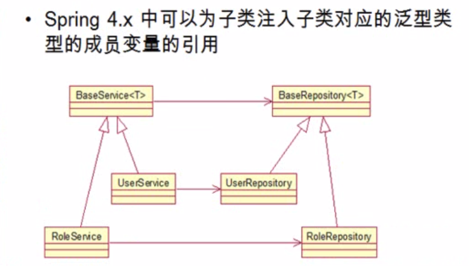
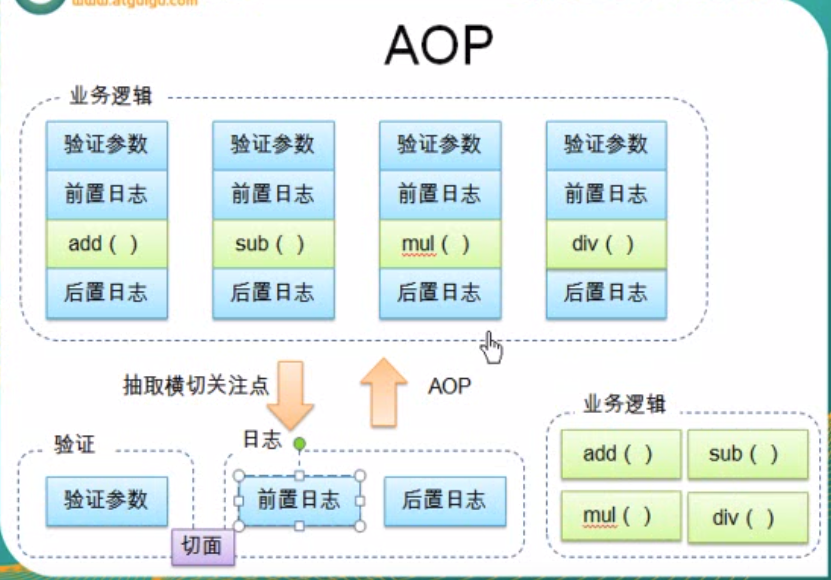

# IOC
Inversion of Control 
* 传统的资源查找方式,是组件像容器发送资源请求,容器响应,并返回资源.
* 而 IOC是, 容器主动将资源推送给它所管理的组件,组件所要做的是,选择一种合适的方式来接收资源.

### IOC容器的实现有两种
*   BeanFactory  是Spring的基础设置,面向 Spring本身
*   ApplicationContext, 面向 Spring开发者,几乎所有场合都直接使用 ApplicationContext 而非BeacFactory
1.  ClassPathXmlApplicationContext : 从类路径下加载配置文件
2. FileSystemXmlApplicationContext :从文件系统加载配置文件

### XML配置里的Bean自动装配
1. byType 根据类型自动装配
2. byName 根据名称自动装配, 必须将目标Bean的名称和属性名设置的完全相同
3. constructor 装配, (不推荐)

### bean之间的关系: 继承, 依赖

### Beand 作用域 
* singleton, 单例(默认), 初始化容器就会创建实例, 永远返回相同的bean 
* prototype, 原型,初始化时不会创建实例, 在被获取时才会创建,每次创建的是不同的bean
* WEB环境作用域

### 使用外部属性文件
* 系统部署的细节信息, 比如连接数据源的信息
1.  PropertyPlaceholderConfigurer 的 BeanFactory后置处理器,这个处理器允许用户将Bean配置的部分内容移到[属性文件]中!

### Spel
* Spring 表达式语言(简称 SpEL): 是一个支持运行时检查和操作对象的强大表达式语言,用 #{...} 表达
1. 简单表示 <property name="count" value="#{5}"> <property name="name" value="#{'lxh'}">
2. 引用 Bean, 属性(这个普通操作做不到)和方法
3. SpEL支持的运算符号,算术,逻辑运算, if else, 正则
4. 调用静态方法和获取静态属性

### IOC 容器中Bean的生命周期方法
1. 普通的生命周期， init, destroy
2. bean后置处理器还可以配置更详细的， before init，和 after init

### 通过工厂方法配置 Bean

### 通过 Spring的 FactoryBean 来配置

### 基于注解的方式
1. 加上注解
2. 在 xml中指定扫描的包(包和子包都会被 IOC容器管理)
* resource-pattern="repository/*.class" //扫描指定位置的class
* include-filter 子节点表示要包含的目标类
* exlcude-filter 子节点表示要排除的目标类
* 在 IOC容器中存在多个类型兼容的Bean时，用两种方法、
1. @Repository("userRepository") 申明Bean的时候，属性名或者字段名一致
2. @Qualifier("userRepositoryImpl")  使用  Qualifier 指定调用的Bean的类

### Spring 4.0 新特性， 泛型依赖注入(如图)




## AOP

*  AOP可以解决的两个问题： ①代码混乱 ②代码分散 （动态代理可以解决【调用方法前插入代码】）
* AOP的优点：
1. 每个事物逻辑位于一个位置，代码不分散，便于维护和升级
2. 业务模块更简洁，只包含核心业务代码 


# DI
Dependency Injection 依赖注入
*   即组件以一些预先定义好的方式(如 Setter方法) 接收来自容器资源注入


# AOP
### * 提取公共的切面,切点
### * AspectJ, 
*  加入 jar包 [AspectJ](http://www.java2s.com/Code/Jar/a/Downloadaspectjweaverjar.htm)
*  配置文件中加入 AOP命名空间
*  基于注解的方式
####  ①配置文件中加入
```xml
<aop:aspectj-autoproxy></aop:aspectj-autoproxy>
```
#### ② 把横切关注点的代码,抽象到切面的类中.
##### &emsp;A.切面首先是一个 IOC中的bean, 即加入@Component注解
##### &emsp;B.切面还需要加入 @Aspect 注解

#### ③ 在类中声明各种通知: 
* @Before 前置通知
* @After 后置通知
* @AfterRunning 返回通知, 在方法返回结果后执行
* @AfterThrowing 异常通知,在方法抛出异常之后
* @Around 环绕通知,围绕着方法执行
##### &emsp; i 声明一个方法
##### &emsp; ii 在方法前加入 @Before 注解
* @Before("execution(public int com.hcyshmily.aop.impl.ArithmeticCalculator.add(int, int))")
>表示,前置通知, public 修饰的, 返回 int的, com.hcyshmily.aop.impl.ArithmeticCalculator 类的 add(int, int) 方法
* 这里的 public 可以替换成 *, 则表示所有修饰类型的方法, 类也可以改成*, 表示所有类
#### ④ 可以在在通知方法中声明一个类型为 JointPoint的参数,然后就能够获取访问连接的细节,比如方法名,参数...
```java
    @Before("execution(public int com.hcyshmily.aop.impl.ArithmeticCalculator.*(int, int))") // 这样就针对所有 (int, int) 参数的方法
    public void beforeMethod(JoinPoint joinPoint) {
        String methodName = joinPoint.getSignature().getName();
        List<Object> args = Arrays.asList(joinPoint.getArgs());
        System.out.println("The method `" + methodName + "` begins with " + args);
    }
```

* 使用 @Order(number)  指定切面执行的优先级, number越小优先级越高


